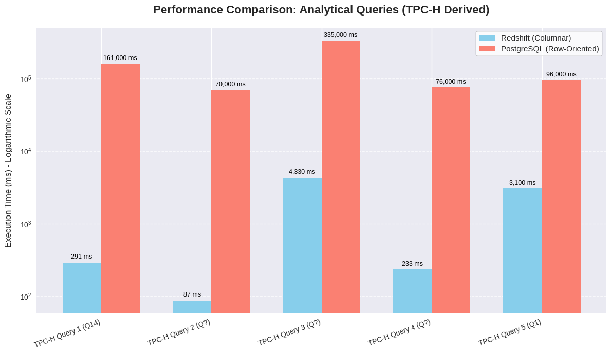

# Performance Comparison of Row-Oriented vs. Column-Oriented Databases on AWS

## Summary

This project performs a hands-on comparison of query execution performance between a traditional row-oriented relational database (PostgreSQL on AWS RDS) and a modern column-oriented data warehouse (Amazon Redshift). Using a standard TPC-H derived benchmark dataset (10GB scale), we measured the execution times for both complex analytical queries and transactional row-level operations (INSERTs, DELETEs). The results quantitatively demonstrate the significant performance advantages of columnar stores for analytical workloads and the efficiency of row-stores for transactional tasks, highlighting the importance of choosing the appropriate database architecture based on primary workload patterns.

## Objective

The primary goal of this project was to empirically investigate and understand the performance characteristics and trade-offs associated with row-oriented versus column-oriented data storage architectures in a cloud environment (AWS) when subjected to different types of database workloads (OLAP vs. OLTP-like operations).

## Methodology

### 1. Database Systems Compared:

* **Row-Oriented:** PostgreSQL deployed on Amazon Relational Database Service (AWS RDS). Configured as per the source lab environment.
* **Column-Oriented:** Amazon Redshift Data Warehouse cluster. Configured as per the source lab environment.

### 2. Dataset Used:

* **Source:** Cloud Data Warehouse Benchmark (derived from TPC-H)
* **Scale:** 10GB
* **Schema:** The standard TPC-H schema was used, representing typical business data relationships (customers, orders, line items, parts, suppliers, nations, regions).

    **Entity Relationship Diagram (ERD):**
    
    

### 3. Workloads Tested:

* **Analytical Queries:** Five complex queries derived from the TPC-H benchmark standard, involving multiple joins, large aggregations, and filtering across large tables (Queries referenced in lab files: `pg_query_0_tcp_h_q14.sql` to `pg_query_4_tcp_h_q1.sql`).
* **Transactional Operations:**
    * **INSERTs:** Execution time for inserting 50 individual rows into the `lineitem` table using separate `INSERT` statements.
    * **DELETEs:** Execution time for deleting the same 50 individual rows using separate `DELETE` statements based on primary key components.

### 4. Measurement Technique:

* Queries were executed within a Jupyter Notebook environment connected to both databases.
* The `ipython-sql` extension and the `%%timeit -n1 -r1` magic command were used to measure the wall-clock execution time for each query/operation block, running each test once to establish a baseline comparison.
* Query caching was disabled in Redshift (`SET enable_result_cache_for_session TO off;`) and a unique comment ID was added to SQL queries to minimize the impact of database-level caching on results.

## Technologies Used

* **Cloud Platform:** Amazon Web Services (AWS)
* **Databases:**
    * AWS RDS for PostgreSQL (Row-Oriented)
    * Amazon Redshift (Column-Oriented)
* **Benchmarking:** TPC-H Derived Dataset & Queries
* **Execution Environment:** Jupyter Notebook
* **Python Libraries:** `ipython-sql`, `psycopg2` (implicitly via connection string), `pandas`, `Faker` (for generating INSERT/DELETE data)
* **Language:** SQL, Python

## Results

The following table summarizes the measured execution times:

| Operation / Query         | Redshift (Columnar) Time | PostgreSQL (Row-Oriented) Time | Key Observation                                                     |
| :------------------------ | :----------------------- | :----------------------------- | :------------------------------------------------------------------ |
| **Analytical Queries:** |                          |                                | **Columnar Significantly Faster** |
| TPC-H Query 1             | **291 ms** | **2 min 41 s** | Orders of magnitude difference for complex analytics                |
| TPC-H Query 2             | **87 ms** | **1 min 10 s** |                                                                     |
| TPC-H Query 3             | **4.33 s** | **5 min 35 s** |                                                                     |
| TPC-H Query 4             | **233 ms** | **1 min 16 s** |                                                                     |
| TPC-H Query 5             | **3.1 s** | **1 min 36 s** |                                                                     |
| **Transactional Ops:** |                          |                                | **Row-Oriented Significantly Faster** |
| INSERTs (50 single rows)  | **7.48 s** | **624 ms** | Row store handles single-row writes much more efficiently           |
| DELETEs (50 single rows)  | **3.69 s** | **460 ms** | Row store handles single-row deletes much more efficiently          |

### Visual Summary of Key Performance Differences:

## Discussion & Analysis

The results clearly align with the theoretical strengths and weaknesses of each storage architecture:

* **Analytical Queries (OLAP):** Redshift's columnar storage demonstrated vastly superior performance. This is because these queries typically scan large volumes of data but only require values from a few columns. Columnar stores minimize I/O by reading only the necessary column data blocks, skipping irrelevant columns entirely. This architecture also allows for more effective compression techniques within columns and facilitates vectorized query execution. PostgreSQL, being row-oriented, needed to read entire rows (or large parts of them) even when only a few columns were needed, leading to significantly higher I/O and processing time for these scan- and aggregation-heavy workloads.
* **Transactional Operations (OLTP-like):** PostgreSQL's row-oriented storage proved much more efficient for inserting and deleting individual rows. Modifying a single record in a row-store typically involves accessing and changing data within a limited number of contiguous blocks on disk where the entire row resides. In contrast, inserting or deleting a single logical "row" in a columnar store like Redshift can require modifying multiple separate column files/blocks, leading to higher write amplification and slower performance for these types of point operations.

## Conclusion

This project provides practical, quantitative evidence supporting the fundamental data engineering principle of selecting storage architecture based on the primary workload.
* For **analytical workloads** requiring fast scans and aggregations over large datasets (OLAP), **column-oriented** systems like Amazon Redshift offer significant performance advantages due to reduced I/O and optimized processing.
* For **transactional workloads** involving frequent single-row reads, inserts, updates, and deletes (OLTP), **row-oriented** systems like PostgreSQL remain highly efficient due to their data layout optimizing for record-level operations.

## Key Skills & Learning Outcomes:

* **Performance Benchmarking & Analysis:** Designed and executed database performance tests, meticulously measuring and comparing execution times for diverse workloads.
* **Database Internals Understanding:** Gained a deep understanding of how row-oriented and column-oriented storage architectures impact query performance for OLAP and OLTP scenarios.
* **AWS Database Services:** Acquired hands-on experience configuring, managing, and querying **AWS RDS for PostgreSQL** and **Amazon Redshift**.
* **SQL & Query Optimization Awareness:** Worked with complex analytical SQL queries (TPC-H) and understood how database architecture influences their efficiency.
* **Problem Solving & Analytical Thinking:** Systematically investigated a common data architecture challenge and derived data-backed conclusions.
* **Technical Documentation:** Clearly documented methodology, results, and analysis.
